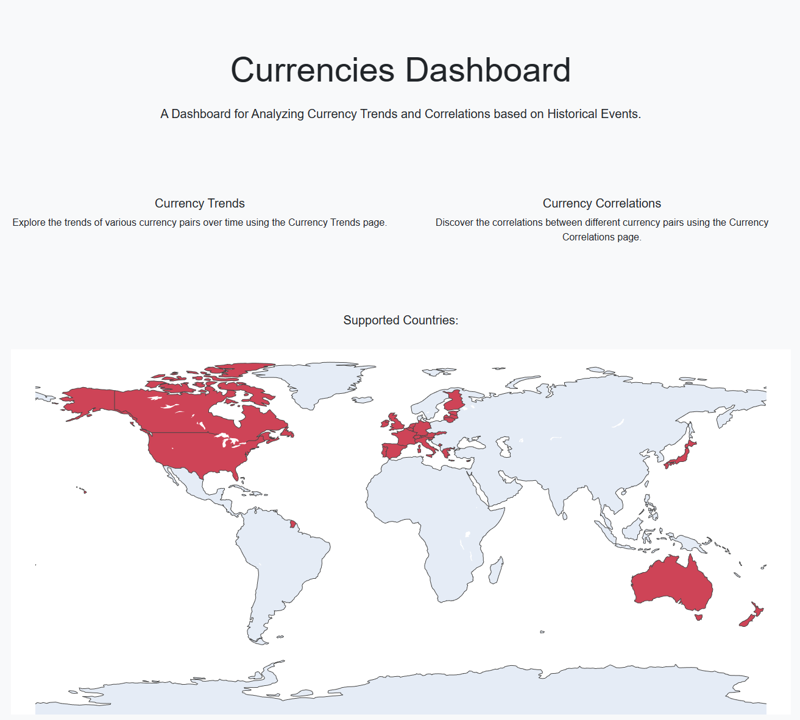

# Currency Dashboard
A Dashboard for Analyzing Currency Trends and Correlations based on Historical Events

## Installation
To install and run the currency dashboard you will need to start the backend first, and afer that the frontend. Before we begin make sure to clone the project and install all necessary requirements. You can find the required packages in the "requirements.txt" file. Uvicorn needs to be installed additionally, to run the backend.
```
git clone https://github.com/barboosa/currency_dashboard.git
cd currency_dashboard
pip install -r requirements.txt
pip install uvicorn
```
### Backend
To run the backend execute following command.
```
cd backend 
python.exe -m uvicorn main:app --port 8000
```
### Frontend
To run the frontend execute following command in the /frontend folder.
```
cd frontend 
python.exe app.py
```
## Usage
This project Currency Dashboard provides you the ability to analyze mutliple things in the forex market. In the Trends Page it is possible to get nromalized historic currency values. These are usefull to check how the influence of a specific event or date was on the forex market. Additionally you can check out the Correlations over a specific time in the Correlations Page.


## License
Distributed under the MIT License. See `LICENSE.txt` for more information.